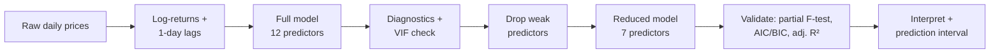

<div align="center">

# Silver as a Safe-Haven
### A Regression Analysis of Daily Silver Spot Returns

*STA302 — Methods of Data Analysis I — University of Toronto*


-2f6fed)


</div>

---

Silver surged over 70% in 2025, outpacing gold and every major equity index. That kind of move raises an obvious question for anyone thinking about portfolio construction: **is silver actually behaving like a safe-haven asset — or is it just riding broader risk sentiment like any other cyclical commodity?**

This project answers that with data, not narrative: 14+ years of daily spot prices, a carefully validated multiple linear regression model, and a direct comparison against the peer-reviewed literature on precious metals.

> **Finding:** Silver is a **hybrid asset**. It tracks gold closely (safe-haven behavior) but also carries statistically significant exposure to equities and oil (cyclical, risk-on behavior) — it is neither a pure hedge nor a pure industrial commodity.

<p align="center">
  
</p>

---

## Contents

- [Research question](#research-question)
- [The data](#the-data)
- [Why this isn't as simple as it looks](#why-this-isnt-as-simple-as-it-looks)
- [Methodology](#methodology)
- [Results](#results)
- [The hybrid-asset story, visually](#the-hybrid-asset-story-visually)
- [Limitations](#limitations)
- [Repository structure](#repository-structure)
- [Reproduce this](#reproduce-this)

---

## Research question

> To what extent do financial market indicators, other precious metal prices, and commodity market conditions explain variations in silver returns — and how do these relationships reveal silver's positioning as a safe-haven asset within broader market conditions?

## The data

| | |
|---|---|
| **Source** | Kaggle "Financial Data" dataset (FranciscoGCC), collected via Alpha Vantage and FRED |
| **Frequency** | Daily |
| **Span** | 2010-01-14 → 2024-10-18 (3,675 trading days after cleaning) |
| **Series** | Silver, gold, S&P 500, Nasdaq, oil, platinum, palladium — **daily closing spot prices** — plus USD/CHF, EUR/USD |

<details>
<summary><b>Spot prices, not futures — why that distinction matters here</b></summary>
<br>

This dataset uses **spot (cash market) closing prices**, not futures contracts. There's no contract identifier, expiry date, or continuous-contract roll-adjustment anywhere in the data or pipeline — all signs of a futures series — and Alpha Vantage / FRED's standard commodity endpoints return spot or spot-fixing prices by default.

This matters for interpretation: spot prices reflect the immediate cash-market price of the metal itself, with no futures-curve effects (contango/backwardation, roll yield, or funding-cost carry) mixed in. That's the right choice for a question about silver's *fundamental* relationship with other markets — a futures-based study would need to separately account for roll-yield noise before the regression coefficients could be cleanly interpreted.
</details>

## Why this isn't as simple as it looks

Naively regressing silver's **price level** on gold's price level would give a deceptively high R² — because both series trend upward together over 14 years for reasons that have nothing to do with any real relationship (shared inflation exposure, long-run bull markets, etc.). That's a classic **spurious regression** trap in financial time series.

The fix: convert every series to **daily log-returns** before modeling.

```
r_t = log(P_t) − log(P_t₋₁)
```

This one transformation does four things at once:
- **Stabilizes variance** — price levels have variance that grows with the price itself; returns don't
- **Removes shared trends** — so any remaining correlation reflects a real day-to-day relationship, not two lines both going up
- **Straightens relationships** — return-vs-return scatter plots are far more linear than price-vs-price
- **Makes coefficients interpretable** — a coefficient of 1.47 on gold literally means "a 1% gold move is associated with a 1.47% silver move"

## Methodology



**1. Full model.** Silver's daily return regressed on 12 predictors: same-day gold, S&P 500, Nasdaq, and oil returns; lagged silver, gold, and S&P 500 returns; platinum and palladium price levels; USD/CHF and EUR/USD; an S&P 500 volatility spread.

**2. Model reduction.** Predictors with weak individual significance (large t-test p-values) were dropped, leaving a 7-predictor reduced model.

**3. Four independent checks that the simpler model is justified:**

| Check | Result | Verdict |
|---|---|---|
| Partial F-test (full vs. reduced) | F = 1.74, p = 0.121 | Dropped variables add no explanatory power |
| Adjusted R² | 0.6612 → 0.6609 | Virtually unchanged |
| AIC / BIC | Both lower for reduced model | Reduced model is more efficient |
| VIF (multicollinearity) | Mostly ~1, equity pair ~7.3 | Below the concern threshold (10) |

**4. Residual diagnostics** on both models (Residuals vs. Fitted, Normal Q-Q, Scale-Location, Residuals vs. Leverage) to check linearity, normality, homoscedasticity, and influential points.

**5. Inference.** 95% confidence intervals on every coefficient, plus a held-out prediction interval checked against the realized outcome.

## Results

**Final model:**

```
silver_ret = β₀ + β₁·gold_ret + β₂·sp500_ret + β₃·nasdaq_ret + β₄·oil_ret
           + β₅·gold_ret_lag1 + β₆·sp500_ret_lag1 + β₇·platinum_level + ε
```

<p align="center">
  
</p>

| Predictor | Estimate | p-value | Interpretation |
|---|---|---|---|
| **Gold return** | 1.465 | < 2e-16 | Dominant driver — strong precious-metal co-movement |
| **S&P 500 return** | 0.376 | 2.4×10⁻¹⁷ | Silver also trades with equity risk sentiment |
| **Oil return** | 0.020 | 4.96×10⁻⁶ | Captures silver's industrial-demand channel |
| S&P 500 return (lag 1) | 0.042 | 0.010 | Modest short-term equity spillover |
| Gold return (lag 1) | 0.032 | 0.076 | Marginal spillover from gold |
| Nasdaq return | −0.071 | 0.053 | Borderline, weak/unstable |
| Platinum level | ~0 | 0.493 | No meaningful effect — dropped in interpretation |

**Adjusted R² = 0.661**

**Prediction interval sanity check:** on a held-out day, the model's 95% prediction interval was [−3.17%, +1.05%]; the actual realized silver return that day was −0.16% — comfortably inside.

## The hybrid-asset story, visually

The clearest evidence for "hybrid asset" isn't in the regression table — it's in how silver's correlation with each market *moves over time*.

<p align="center">
  
</p>

Silver's correlation with **gold** stays consistently high (roughly 0.6–0.9) across the entire 14-year sample — a stable safe-haven relationship. Its correlation with the **S&P 500**, by contrast, swings from +0.5 to below zero depending on the market regime, spiking during risk-off shocks (2020, 2022) — exactly the kind of unstable, regime-dependent relationship you'd expect from a partly cyclical asset.

<details>
<summary><b>Full correlation matrix (daily log-returns)</b></summary>
<br>
<p align="center">
  
</p>
</details>

## Limitations

- **Heavy-tailed residuals** — visible in the Q-Q plot; expected for daily financial returns, but widens prediction intervals
- **Mild heteroskedasticity** persists even after model reduction
- **Omitted variables** — no VIX, interest-rate, or macro-announcement variables included
- **No time-series structure modeled** — OLS doesn't capture autocorrelation or regime shifts; a GARCH extension is a natural next step
- **Market microstructure noise** — non-synchronous daily closes across assets add measurement noise

## Repository structure

```
├── README.md
├── scripts/
│   └── analysis.R                    # full R workflow: data prep, full/reduced
│                                      # models, diagnostics, VIF, partial F-test,
│                                      # AIC/BIC, confidence & prediction intervals
├── data/
│   └── model_data.csv                # cleaned, return-transformed modelling dataset
├── images/                           # charts embedded in this README
├── report/
│   └── STA-302-PROJECT-PART-2.pdf    # full written report
└── poster/
    └── STA302_209_Poster.pdf         # one-page visual summary
```

## Reproduce this

```r
# Requires: tidyverse, car
source("scripts/analysis.R")
```

The script loads `data/model_data.csv`, fits the full and reduced models, runs all diagnostics (VIF, partial F-test, AIC/BIC), and reproduces every result reported above.

## Literature

- Adamkovičová & Blažek (2021), *"Gold and Silver as Safe Havens,"* SHS Web of Conferences
- Cohen (2022), *"Algorithmic Strategies for Precious Metals Price Forecasting,"* ResearchGate
- Fatima, Gan & Hu (2022), *"Volatility Analysis of Precious Metals,"* Journal of Risk and Financial Management

---
<div align="center">

*Course project for STA302, Fall 2025 · University of Toronto*

</div>
