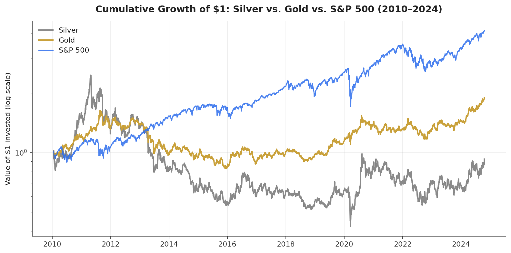
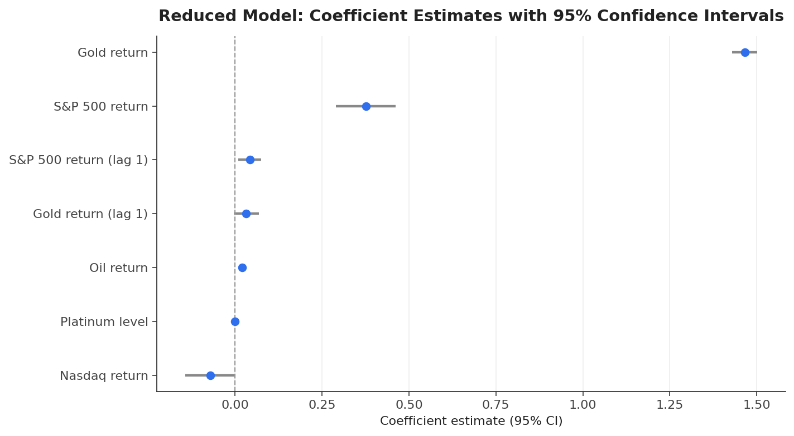
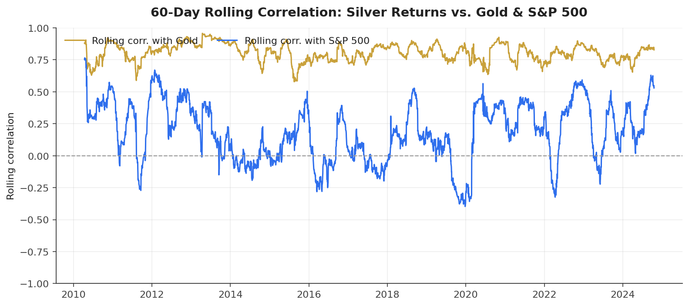

# Silver as a Safe-Haven

This repository contains a regression analysis of daily silver returns, examining whether silver behaves as a safe-haven asset or a cyclical commodity, in the context of its 70%+ price surge in 2025.

## Project Overview

The objective of this project is to explain daily movements in silver returns using multiple linear regression on gold, equity, oil, and other precious-metal/FX indicators. The analysis includes data preprocessing (log-returns), model selection (full vs. reduced model), residual diagnostics, and interpretation against the empirical literature on precious metals.

**Data:** Daily closing spot prices (not futures) for silver, gold, S&P 500, Nasdaq, oil, platinum, palladium, USD/CHF, and EUR/USD — 2010-01-14 to 2024-10-18 (~3,675 trading days). Source: Kaggle "Financial Data" dataset (FranciscoGCC), collected via Alpha Vantage and FRED.

## Key Result

Silver is a **hybrid asset**. Its strongest driver is gold (coefficient ≈ 1.47, p < 2e-16), consistent with safe-haven behavior, but it also carries significant positive exposure to the S&P 500 (≈ 0.38) and oil (≈ 0.02) — evidence it also trades with equity risk sentiment and industrial demand. Adjusted R² = 0.661.





Silver's rolling correlation with gold stays consistently high (~0.6–0.9) across the full sample, while its correlation with the S&P 500 swings and even turns negative during risk-off periods (2020, 2022) — visual evidence of its dual nature.



## Repository Structure

- `model_data.csv`: cleaned, return-transformed dataset used for modelling
- `analysis.R`: full R workflow — data prep, full/reduced models, VIF, partial F-test, AIC/BIC, confidence and prediction intervals
- `cumulative_returns.png`, `coefficient_plot.png`, `rolling_correlation.png`, `correlation_heatmap.png`: charts referenced above and in the report
- `STA-302-PROJECT-PART-2.pdf`: full written report with all diagnostics and literature review
- `STA302_209_Poster.pdf`: one-page visual summary

## Getting Started

### Prerequisites

- R (version 4.0 or higher)
- RStudio (recommended)

### Required R Packages

```r
install.packages(c("tidyverse", "car"))
```

### Running the Analysis

Clone the repository:
```
git clone https://github.com/vedantriyer/silver-spot-prices-regression.git
```

Open `analysis.R` in RStudio and run the code chunks sequentially to reproduce the full model, reduced model, diagnostics, and inference results.

## Results Summary

| Predictor | Estimate | p-value |
|---|---|---|
| Gold return | 1.465 | < 2e-16 |
| S&P 500 return | 0.376 | 2.4×10⁻¹⁷ |
| Oil return | 0.020 | 4.96×10⁻⁶ |
| S&P 500 return (lag 1) | 0.042 | 0.010 |
| Gold return (lag 1) | 0.032 | 0.076 |

Model selection was validated with a partial F-test (F = 1.74, p = 0.121), adjusted R² comparison, and AIC/BIC, all confirming the reduced 7-predictor model over the full 12-predictor model.

## Limitations

Heavy-tailed residuals, mild heteroskedasticity, omitted macro variables (VIX, interest rates), and no time-series structure (autocorrelation/regime shifts) modeled.

## References

- Adamkovičová & Blažek (2021), "Gold and Silver as Safe Havens," SHS Web of Conferences
- Cohen (2022), "Algorithmic Strategies for Precious Metals Price Forecasting," ResearchGate
- Fatima, Gan & Hu (2022), "Volatility Analysis of Precious Metals," Journal of Risk and Financial Management
